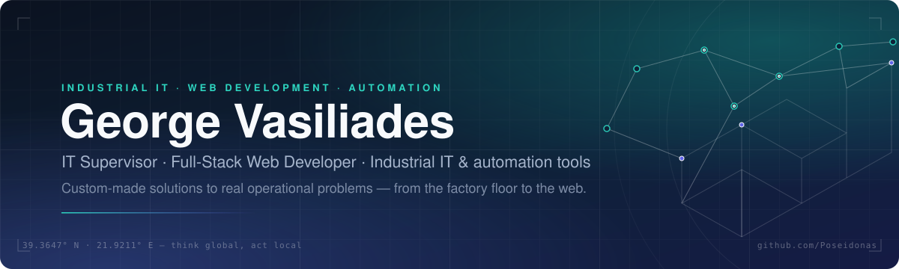

<picture>
  <source media="(prefers-color-scheme: dark)" srcset="assets/banner-dark.svg">
  <source media="(prefers-color-scheme: light)" srcset="assets/banner-light.svg">
  
</picture>

  
  
  

---

## About me

- **IT Supervisor** in the food-manufacturing industry — I run the infrastructure that keeps production, warehouses and offices online, every day.
- When an off-the-shelf tool doesn't fit the process, **I build it**: monitoring dashboards, production-planning (MRP) tools, integrations between systems, automation scripts.
- **Independent web developer** — business websites, e-commerce and web applications across multiple platforms.
- Lifelong learner — 120+ certifications spanning infrastructure, cloud, data, software engineering and technology leadership.
- My rule of thumb: *understand the process first, then write the code.*

## What I do

<table>
<tr>
<td width="50%" valign="top">

### Industrial IT &amp; Operations
- Infrastructure design &amp; administration — Windows Server, Active Directory, virtualization, networking
- Monitoring, NOC dashboards &amp; incident response
- ERP / MRP support and custom production-planning tools
- Business continuity, disaster recovery &amp; information security (ISO 27001 / ISO 22301)
- Automation &amp; scripting — PowerShell, Python

</td>
<td width="50%" valign="top">

### Web &amp; Software Development
- Full-stack web apps — TypeScript / JavaScript, PHP · Laravel, React / Vue
- Business websites &amp; e-commerce on multiple platforms
- REST APIs, integrations &amp; data flows between systems
- Dashboards &amp; reporting — SQL, Power BI
- Clean, maintainable code — built to be handed over, not rewritten

</td>
</tr>
</table>

## Tech stack

**Infrastructure &amp; Operations**

         

**Web &amp; Software**

          

**Data &amp; Enterprise systems**

      

**Practices**

    

## Featured projects

### Payload CMS packages

A family of small, single-purpose packages for Payload ecommerce. Each one closes a gap the official plugin leaves open, does one thing only, and ships with its own tests, CI and release pipeline. All are TypeScript, MIT licensed, and published to npm with build provenance.

[**payload-commerce-kit**](https://github.com/Poseidonas/payload-commerce-kit) is the index of the family: the measured gaps, the design rules and the state of each package.

| Package | What it does | |
|---|---|---|
| [**payload-order-numbers**](https://github.com/Poseidonas/payload-order-numbers) | Human readable sequential order numbers for Payload ecommerce, unique under concurrency. | [`npm`](https://www.npmjs.com/package/payload-order-numbers) |
| [**payload-order-emails**](https://github.com/Poseidonas/payload-order-emails) | Transactional email on Payload order creation and status changes, with overridable templates and customer or admin recipients. | [`npm`](https://www.npmjs.com/package/payload-order-emails) |
| [**payload-fulfillment**](https://github.com/Poseidonas/payload-fulfillment) | Extra order states, transition history, internal notes and tracking for Payload ecommerce orders. | [`npm`](https://www.npmjs.com/package/payload-fulfillment) |
| [**payload-invoices**](https://github.com/Poseidonas/payload-invoices) | Gapless sequential invoices and credit notes for Payload ecommerce, with a frozen snapshot and PDF output, no runtime dependencies. | [`npm`](https://www.npmjs.com/package/payload-invoices) |
| [**payload-refunds**](https://github.com/Poseidonas/payload-refunds) | Full and partial refunds for Payload ecommerce, per line item, with optional restock and an append only audit trail. | [`npm`](https://www.npmjs.com/package/payload-refunds) |
| [**payload-stock-reservation**](https://github.com/Poseidonas/payload-stock-reservation) | Validates variant stock and price for Payload ecommerce, which the official plugin never does, and holds stock from checkout until payment settles. | [`npm`](https://www.npmjs.com/package/payload-stock-reservation) |
| [**payload-stock-alerts**](https://github.com/Poseidonas/payload-stock-alerts) | Low stock thresholds, admin notification on the downward crossing and backorder handling for Payload ecommerce. | [`npm`](https://www.npmjs.com/package/payload-stock-alerts) |
| [**payload-shipping-classes**](https://github.com/Poseidonas/payload-shipping-classes) | Weight, dimensions and a shipping class on Payload products and variants, stored in one canonical unit. | [`npm`](https://www.npmjs.com/package/payload-shipping-classes) |
| [**payload-shipping-rates**](https://github.com/Poseidonas/payload-shipping-rates) | Shipping zones, methods and rate calculation for Payload ecommerce, in integer minor units. | [`npm`](https://www.npmjs.com/package/payload-shipping-rates) |
| [**payload-tax-eu**](https://github.com/Poseidonas/payload-tax-eu) | EU VAT for Payload ecommerce: rates by country, B2B reverse charge, VAT number validation and OSS totals. | [`npm`](https://www.npmjs.com/package/payload-tax-eu) |
| [**payload-coupons**](https://github.com/Poseidonas/payload-coupons) | Coupon codes and discounts for Payload ecommerce, in integer minor units with exact rounding. | [`npm`](https://www.npmjs.com/package/payload-coupons) |
| [**payload-reviews**](https://github.com/Poseidonas/payload-reviews) | Product reviews for Payload ecommerce, with a verified purchase flag computed from real orders, moderation, and an aggregate rating that never drifts. | [`npm`](https://www.npmjs.com/package/payload-reviews) |
| [**payload-abandoned-cart**](https://github.com/Poseidonas/payload-abandoned-cart) | Marks idle Payload carts abandoned, sends a recovery sequence through payload.sendEmail, and attributes the orders it recovers. | [`npm`](https://www.npmjs.com/package/payload-abandoned-cart) |
| [**payload-downloads**](https://github.com/Poseidonas/payload-downloads) | Digital products for Payload ecommerce: signed expiring download links, per order access and download limits. | [`npm`](https://www.npmjs.com/package/payload-downloads) |
| [**payload-sales-reports**](https://github.com/Poseidonas/payload-sales-reports) | Sales totals by period, product and customer for Payload ecommerce, as data and endpoints with no admin component required. | [`npm`](https://www.npmjs.com/package/payload-sales-reports) |

### WordPress and WooCommerce plugins

| Project | What it does | Stack |
|---|---|---|
| [**hardening-essentials**](https://github.com/Poseidonas/hardening-essentials) | Ten independent WordPress hardening switches on one native settings page. No scanner, no firewall, no bundled extras. Updates delivered from GitHub Releases. | PHP · WordPress |
| [**debloat-essentials**](https://github.com/Poseidonas/debloat-essentials) | Fifteen switches that turn off what WordPress loads by default and most sites never use: emojis, embeds, head links, jQuery Migrate, heartbeat, revisions and more. No caching, no minification. | PHP · WordPress |
| [**staging-safeguards**](https://github.com/Poseidonas/staging-safeguards) | Keeps staging, development and local copies from acting like the live site: intercepts outgoing email, blocks indexing, stops WooCommerce webhooks and marks the environment in the admin. Does nothing on production. | PHP · WordPress · WooCommerce |
| [**delayed-updates**](https://github.com/Poseidonas/delayed-updates) | Holds automatic updates back until a version has been out for a set number of days, so releases have time to prove themselves. Manual updates are untouched. | PHP · WordPress |
| [**notices-drawer**](https://github.com/Poseidonas/notices-drawer) | Collects admin notices into one collapsible drawer and names the plugin each notice came from. Error notices and WordPress notices stay in place. No JavaScript. | PHP · WordPress |
| [**search-essentials**](https://github.com/Poseidonas/search-essentials) | Makes site search find what is already there: taxonomy terms, custom fields such as the WooCommerce SKU, and variation codes. Adds relevance ordering and a live report on what the database itself already handles. | PHP · WordPress · WooCommerce |
| [**image-metadata**](https://github.com/Poseidonas/image-metadata) | Writes the alt text, caption and title of images in the media library using the AI provider already configured in WordPress. Existing values are never overwritten. | PHP · WordPress · AI client |
| [**ai-provider-for-kimi**](https://github.com/Poseidonas/ai-provider-for-kimi) | Adds Kimi by Moonshot AI to the WordPress AI Client, so it appears on the Connectors screen beside Anthropic, Google and OpenAI and can be used by anything that asks WordPress for AI. | PHP · WordPress · AI client |
| [**login-alerts**](https://github.com/Poseidonas/login-alerts) | Emails a user when their account is signed in to from a device WordPress has not seen before, and shows the sessions WordPress already records so a single one can be ended. | PHP · WordPress |
| [**upload-control-rules**](https://github.com/Poseidonas/upload-control-rules) | Rules applied to every media upload: transliterated lowercase file names, camera metadata removed from the original file, and control over the sizes, quality and duplicates WordPress produces. | PHP · WordPress |
| [**woo-quantity-control-rules**](https://github.com/Poseidonas/woo-quantity-control-rules) | Minimum, maximum and step quantities for WooCommerce by product, variation, category, tag and user role, with order limits by item count and by value, enforced in the classic cart and in the block checkout alike. | PHP · WooCommerce |
| [**checkout-guard-rules**](https://github.com/Poseidonas/checkout-guard-rules) | Refuses WooCommerce orders that match rules you set on email, phone, address, country or network, with automatic rules built from order history, an allow list that always wins, and a log of every decision. | PHP · WooCommerce |
| [**customer-purchase-limits**](https://github.com/Poseidonas/customer-purchase-limits) | Limits how much of a product, a variation or a category one customer may buy over a period of time, counted from real order history with refunds subtracted, shown on the product page before the cart fills up. | PHP · WooCommerce |
| [**free-shipping-meter**](https://github.com/Poseidonas/free-shipping-meter) | Tells the customer how much more is needed for free shipping, read from the shipping zone that actually applies and counted the way WooCommerce counts it, on the classic pages and on the blocks alike. | PHP · JS · WooCommerce |
| [**product-retirement**](https://github.com/Poseidonas/product-retirement) | Retires a product without deleting it: the page stays live and indexed, the buy button goes, the structured data says discontinued rather than out of stock, and a replacement can be offered in its place. | PHP · WooCommerce |
| [**custom-order-statuses**](https://github.com/Poseidonas/custom-order-statuses) | Order statuses of your own, each one saying plainly whether it counts as paid, whether it reduces stock, and what email it sends, with a bulk action in the orders list. | PHP · WooCommerce |
| [**shareable-coupons**](https://github.com/Poseidonas/shareable-coupons) | Links that apply a WooCommerce coupon and land the customer where you choose, each with its own expiry, its own usage limit and a record of the orders it brought in. | PHP · WooCommerce |

## Certifications &amp; continuous learning

A selection — the full list (120+) is on [LinkedIn](https://www.linkedin.com/in/g-vasileiadis/details/certifications/).

| Area | Highlights |
|---|---|
| **Technology leadership** | Executive Diploma – Chief Technology Officer · Advanced Diploma in Technology Management · Professional Certificate in Agile &amp; Scrum |
| **Infrastructure &amp; security** | VMware vSphere Mastery · Windows Server 2022 &amp; Active Directory · ISO 27001 (Cybersecurity) · ISO 22301 &amp; Disaster Recovery / BCP |
| **Cloud &amp; DevOps** | Professional Certificate in DevOps · Kubernetes DevOps · AWS (IAM, VPC Security, Containers) |
| **Enterprise &amp; data** | SAP (Query, BusinessObjects, ABAP Dictionary) · Microsoft Power BI &amp; Fabric · Oracle SQL |

## Get in touch

  <picture>
    <source media="(prefers-color-scheme: dark)" srcset="assets/seal-dark.svg">
    <source media="(prefers-color-scheme: light)" srcset="assets/seal-light.svg">
    
  </picture>

  

